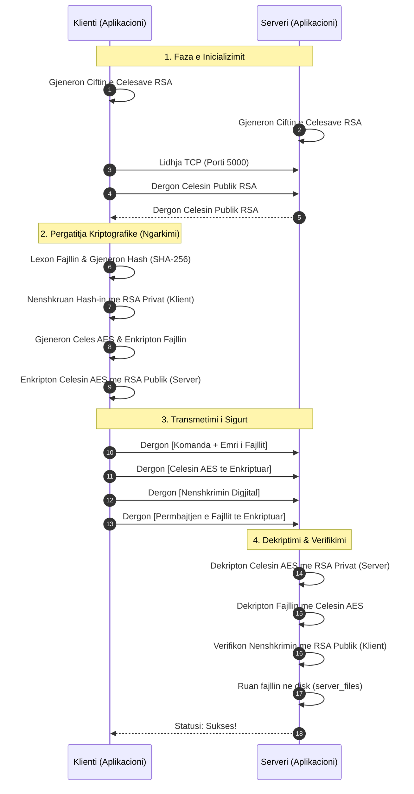

# Protokolli i Sigurt i Transferimit te Fajllave (Kriptografia Hibride)

**Lenda:** Siguria e te Dhenave / Kriptografia  
**Gjuha Programuese:** Python 3  
**Viti Akademik:** 2025/2026  

---

## 📖 Permbledhja e Projektit

Ky projekt implementon nje sistem te plote dhe te sigurt per transferimin e fajllave sipas modelit Klient-Server. Per te garantuar mbrojtjen maksimale te te dhenave ne rrjet, sistemi yne perdor nje **qasje te Kriptografise Hibride**. 

Duke kombinuar shpejtesine dhe efikasitetin e enkriptimit simetrik (AES) per transferimin e fajllave te medhenj, me sigurine e padiskutueshme te enkriptimit asimetrik (RSA) per shkembimin e celesave, ne kemi ndertuar nje protokoll qe permbush te gjitha standardet moderne te sigurise kibernetike.

---

## 🚀 Karakteristikat Kryesore

### 1. Kriptografia dhe Siguria
* **Enkriptimi Simetrik (AES-256):** Cdo fajll qe transferohet enkriptohet duke perdorur algoritmin AES ne modin CBC (Cipher Block Chaining). Kjo siguron qe te dhenat jane te palexueshme per kedo qe i pergjon ne rrjet.
* **Enkriptimi Asimetrik (RSA-2048):** Celesat simetrik AES nuk dergohen kurre te pambrojtur. Ata enkriptohen me celesat publik RSA te marresit perpara transferimit.
* **Integriteti dhe Autentifikimi (SHA-256 & Nenshkrimet Digjitale):** Para dergimit, fajlli kalon neper nje funksion hash (SHA-256). Ky hash me pas nenshkruhet me celesin privat RSA te derguesit, duke i garantuar marresit qe fajlli nuk eshte ndryshuar dhe qe vjen pikerisht nga burimi i duhur.

### 2. Arkitektura e Rrjetit dhe Aplikacionit
* **Nderfaqja e Perdoruesit (UI):** Klienti ofron nje menu te paster dhe interaktive ne terminal qe nuk nderpritet, duke i lejuar perdoruesit te ngarkoje (upload) ose te shkarkoje (download) fajlla pafundesisht.
* **Besueshmeria e Transmetimit (Length-Prefixing):** Rrjetet TCP mund te ndajne paketat ne menyre te paparashikueshme. Ne kemi implementuar dergimin me gjatesi paraprake (length-prefixing `struct.pack`) per te garantuar qe asnje bit te mos humbase apo korruptohet.
* **Menaxhimi i Dosjeve:** Sistemi krijon dhe menaxhon automatikisht direktorite `client_files` dhe `server_files` per nje eksperience sa me te paster.

---

## 📂 Struktura e Dosjeve (Project Structure)

Projekti eshte ndare ne disa module per te mbajtur kodin te paster dhe te menaxhueshem:

```text
📁 Projekti_Kriptografia/
│
├── 📄 server.py        # Aplikacioni qendror i serverit qe menaxhon lidhjet
├── 📄 client.py        # Aplikacioni i klientit me nderfaqen per perdoruesin
├── 📄 aes_utils.py     # Moduli per gjenerimin e AES, Hash-it dhe Enkriptimit
├── 📄 rsa_utils.py     # Moduli per gjenerimin e RSA dhe Nenshkrimeve
├── 📄 README.md        # Ky dokument shpjegues
│
├── 📁 server_files/    # Dosja ku serveri ruan fajllat e marre nga klientet
└── 📁 client_files/    # Dosja ku klienti ruan fajllat e shkarkuar nga serveri
```

---

## 🛠️ Udhezuesi i Instalimit

Per te ekzekutuar kete projekt, sigurohuni qe keni te instaluar **Python 3**. Gjithashtu, per shkak se Python nuk vjen me mbeshtetje te plote per RSA dhe AES nga fabrika, ju duhet te instaloni librarine e sigurise `pycryptodome`.

Hapni terminalin (Command Prompt / PowerShell / Bash) dhe shkruani:

```bash
pip install pycryptodome
```

---

## 💻 Udhezuesi i Perdorimit (Testimi)

### Hapi 1: Nisja e Serverit
Hapni nje terminal, navigoni tek follderi i projektit dhe ekzekutoni serverin:
```bash
python server.py
```
*Serveri do te gjeneroje celesat e tij RSA dhe do te prese ne portin 5000.*

### Hapi 2: Nisja e Klientit
Hapni nje terminal te **dyte**, navigoni tek i njejti follder dhe ekzekutoni klientin:
```bash
python client.py
```

### Hapi 3: Ndarja e Fajllave
* Ne menu, shtypni **1** per te derguar nje fajll. Shkruani emrin e nje fajlli lokal (psh. `dokument.txt`). 
* Sistemi do ta enkriptoje ne prapaskene, do ta dergoje ne server, dhe serveri do ta ruaje te sigurt brenda dosjes `server_files`.
* Shtypni **2** nese deshironi te merrni nje fajll nga serveri prapa ne kompjuterin tuaj.

---

## ⚙️ Si funksionon Protokolli? (Nen Kapak)

Kur ju kerkoni te dergoni nje fajll, ndodhin keto procese delikate kriptografike:

1. **Lidhja (Handshake):** Klienti lidhet me Serverin ne `127.0.0.1:5000`. Ata menjehere shkembejne celesat e tyre publik RSA me njeri-tjetrin.
2. **Paketimi Simetrik:** Klienti lexon fajllin tuaj dhe gjeneron nje celes te ri, unik AES-256. Fajlli mbyllet plotesisht (enkriptohet) me kete celes.
3. **Nenshkrimi:** Klienti nxjerr gjurmen (Hash SHA-256) te fajllit origjinal dhe e nenshkruan kete gjurme duke perdorur celesin e tij Privat RSA.
4. **Mbeshtjellja Asimetrike:** Celesi unik AES mbyllet brenda nje kutie te sigurt (enkriptohet) duke perdorur Celesin Publik RSA te Serverit. (Tani vetem serveri mund ta hape ate).
5. **Dergimi:** Klienti nis pakon e plote ne rrjet.
6. **Hapja dhe Verifikimi:** Serveri perdor celesin e tij Privat RSA per te hapur celesin AES. Me pas verifikon nenshkrimin per tu siguruar qe fajlli nuk eshte prekur nga hackera. Ne fund, perdor celesin AES per te zberthyer fajllin dhe e ruan ate.

---

## 📊 Diagrami i Sekuences (Procesi i Upload)

Me poshte paraqitet diagrami rrjedhes i komunikimit te plote. *(Kodi ne vazhdim perdor Mermaid JS dhe do te kthehet automatikisht ne grafike nga GitHub).*



---

## 🖥️ Shembull nga Terminali (Output)

**Pamja nga Serveri:**
```text
=========================================
 🔒 Secure File Transfer Server 🔒 
=========================================
Gjenerimi i celesave RSA...
Celesat RSA u gjeneruan me sukses.

[+] Serveri po degjon ne 127.0.0.1:5000
[+] Ne pritje te lidhjeve nga klientet...

[+] Lidhje e re nga ('127.0.0.1', 54321)
[*] Duke u pergatitur per te pranuar fajllin: test.txt
[+] Nenshkrimi u verifikua. Fajlli eshte origjinal.
[+] Fajlli u ruajt me sukses ne server_files/test.txt
[-] Lidhja u mbyll per ('127.0.0.1', 54321)
```

**Pamja nga Klienti:**
```text
Gjenerimi i celesave RSA...
Celesat RSA u gjeneruan me sukses.

========================================
 🔒 Secure File Transfer Client 🔒
========================================
  1. Ngarko nje fajll ne Server (Upload)
  2. Shkarko nje fajll nga Server (Download)
  3. Dil
========================================
Zgjidhni nje opsion (1-3): 1

Shkruani rrugen e fajllit per dergim: test.txt

[+] Duke lexuar 'test.txt'...
[+] Fajlli u hashua dhe u enkriptua me AES.
[+] Lidhja me serverin ne 127.0.0.1:5000...
[+] Celesat RSA u shkembyen me sukses!
[+] Celesi AES dhe Fajlli u derguan ne menyre te sigurt.
[+] Pergjigja nga Serveri: SUCCESS: Fajlli u ngarkua dhe u ruajt.
```